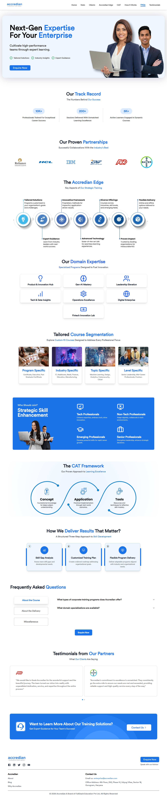
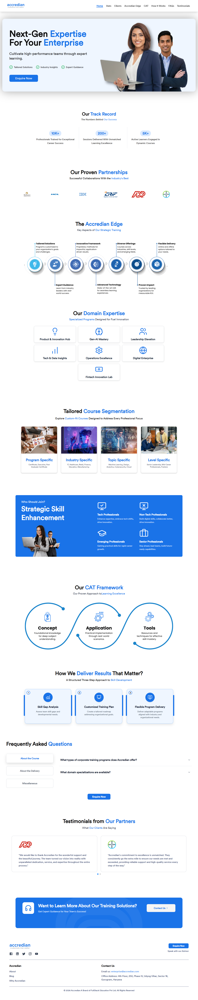

#  Accredian Enterprise Clone by Pritam Debnath


- A responsive recreation of the Accredian Enterprise landing page built with Next.js, TypeScript, Tailwind CSS, Shadcn UI, and Swiper.

------

## 🔴 Demo

### 🔴 🖼️ Screenshot
#### Real vs Clone

<div style="display: flex; justify-content: space-around;">
  
  
</div>

### 🔴 🖼️ Live
https://accredian-assessment-by-pritam.vercel.app/

## Approach
- Broke the page into independent, reusable sections.
- Used data-driven arrays for repeated cards and content.
- Used `Swiper` for responsive horizontal carousels.
- Used Tailwind CSS for responsive styling and layout.
- Used Next.js `Image` for image optimization.

## AI Usage

AI was used as a development assistant for:
- Component and project structure suggestions
- Tailwind CSS implementation ideas
- Debugging and resolving development issues

#### ChatGPT conversation link
https://chatgpt.com/share/6a6b437b-ad20-83ee-b80e-5372a9958b01

---
## Setup instructions

```
npm run corepack:enable
``` 
```
pnpm install
``` 
```
npm run dev
```

---

## Improvements you would make with more time
- Add more refined animations and transitions
- Further refine mobile interactions
- Add API layer to display real data